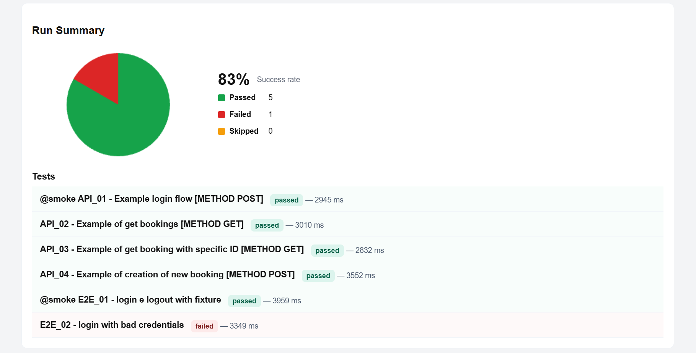

# JecoFramework - Enterprise Playwright Automation Framework


JecoFramework is an enterprise Playwright-based automation framework
designed to provide:

- Project-based execution (native Playwright `projects`: `e2e`, `api`)
- Page Object Model
- Fixtures
- Logging
- Reporting
- Multi-environment support
- Continuous integration

Licensed under Apache 2.0.

## Quick Start

```bash
git clone https://github.com/Jeco16/JecoFramework

npm install

npm run test
```

Run a single project (e2e or api):

```bash
npm run test:e2e
npm run test:api
```

Run a single test:

```bash
npm run test:api -- -g "API_01"
```

## Features

✅ Playwright

✅ JavaScript (ES Modules)

✅ Node.js

✅ Native Playwright projects (e2e/api)

✅ Continuous Integration Ready

✅ Page Object Model

✅ Custom Fixtures

✅ Environment management

✅ Logging

✅ HTML Reporting with Playwright-Report

✅ Apache 2.0 License

✅ Eslint/Prettier

## Prerequisites

- Node.js >= 20.0 (see `package.json` "engines")
- Recommended: commit `package-lock.json` for reproducible installs

## Installation

1. Clone repository:

```bash
git clone https://github.com/Jeco16/JecoFramework
```

2. Install node deps:

```bash
npm install
```

3. Install browsers (optional)

```bash
npx playwright install
```

## Project Structure

```text
│
├── 📁 .github/workflows
│   │
│   └── 📄ci.yml → Configuration file where the steps for CI are defined
│
├──🗄️ artifacts → Folder where all run artifacts (screenshots, videos, traces) will be saved
│
├──🗄️ node_modules → Node file installation folder
│
├──🗄️ playwright-report → Folder where the HTML execution reports will be saved
│
├── 📁 src
│   │
│   ├── 🟦 api
│   │   │
│   │   ├── 📄 api.client.js → HTTP transport layer
│   │   │
│   │   └── 📄 api.assertions.js → Domain assertions for API responses
│   │
│   ├── 🟦 assertions/ 📄 fail.assertions.js → Management of assertions
│   │
│   ├── 🟦 config/ 📄 env.config.js → Environment-specific base URLs and credentials
│   │
│   ├── 🟦 pages
│   │   │
│   │   ├── 📄 base.page.js → Generic POM base class
│   │   │
│   │   └── 📄 login.page.js → Example page object
│   │
│   └── 🟦 utils
│       │
│       ├── 🟩 images → Image source for the README
│       │
│       └── 📄 logger.js → Log management
│
├── 📁 tests
│   │
│   ├── 🟦 e2e/ 📄 login.spec.js → Sample automated E2E test
│   │
│   ├── 🟦 api/ 📄 booking.spec.js → Sample automated API test
│   │
│   └── 🟦 fixtures/ 📄 fixtures.js → Generic fixture file
│
├── 📄 .eslintrc.cjs / .eslintignore / .prettierrc / .prettierignore → Lint/format config
│
├── 📄 .gitignore
│
├── 📄 CHANGELOG.md
│
├── 📄 LICENSE
│
├── 📄 NOTICE
│
├── 📄 package-lock.json
│
├── 📄 package.json
│
├── 📄 playwright.config.js → Single source of truth: `projects` for `e2e` and `api`
│
└── 📄 README.md
```

## Tests

The framework comes with two native Playwright `projects`:

- **e2e** (`tests/e2e/**`) — browser-based tests using the Page Object Model.
- **api** (`tests/api/**`) — HTTP tests using the `api` fixture (see `src/api/api.client.js`).

Each test file is a plain Playwright spec — create new ones simply by adding a `*.spec.js` file under `tests/e2e/` or `tests/api/`, no scaffolding step required.

1. Run all tests

```bash
npm run test
npm run test:headed
```

2. Run a single project

```bash
npm run test:e2e
npm run test:api
```

3. Filter by tag (e.g. smoke tests) or project, using Playwright's native CLI flags

```bash
npm run test -- --grep "\@smoke\"
npm run test -- --project=api
```

## Environment management

Environments and credentials are centralized in `src/config/env.config.js`:

```javascript
const environments = {
  dev: {
    baseURL: 'https://www.saucedemo.com/',
    apiURL: 'https://restful-booker.herokuapp.com/',
  },
  qa: {/* ... */},
  prod: {/* ... */},
  preprod: {/* ... */},
};
```

The active environment is selected via the `ENV` environment variable (default: `dev`):

```powershell
$env:ENV='qa'; npm run test
```

`env.baseURL`, `env.apiURL` and `env.credentials` are then imported directly in test files (see `tests/e2e/login.spec.js` and `tests/api/booking.spec.js`) — no tag parsing or per-suite config file needed.

## Continuous integration

In this framework, a **CI workflow** (ci.yml) is configured that runs npm ci, installs the Playwright browsers, applies npm run lint:fix, launches the smoke tests with --grep **"@smoke"** in headless **(HEADLESS=true)**, and loads the playwright-report and artifacts artifacts.

### CI steps

```powershell
Install dependencies
run: npm ci

Install Playwright browsers
run: npm run install:browsers

Run lint
run: npm run lint:fix

Run smoke tests
run: 'npm run test -- --grep "\@smoke\"'
```

### Smoke test configuration

You can add a test to the CI using the **"@smoke"** tag.
It is possible to add the tag directly to the title of the test in question.

```javascript
test.describe('Saucedemo - E2E', () => {
  test('@smoke login e logout con fixture', async ({ basePage, loginPage }) => {
```

## Report

This framework implements the **Playwright-report** reporting service natively: `playwright.config.js` configures the `html` reporter with a single `outputFolder: 'playwright-report'`, no post-run manipulation of the report files is required.

This is an example of report:



## Eslint/Prettier

The functionalities of **ESLint** and **Prettier** are integrated into this framework.

The commands for using the controls are as follows:

1. Prettier:

```bash
npm run format
```

2. ESLint, check only:

```bash
npm run lint
```

3. ESLint, check and fix:
4.

```bash
npm run lint:fix
```

## Version

Current version: 0.5.0

For more information, consult the **CHANGELOG.md** file.

## Roadmap

### v0.6.0

- Update report
- Test-data management

### v0.7.0

- `.env.example` files and secrets handling guidelines
- Framework self-tests

### v0.8.0

- Automatic release processes
- Automatic Changelog.md
- Dependency security scanning in CI (npm audit)

### v1.0.0

- Stable public release
- Full documentation pass (CONTRIBUTING, troubleshooting, multi-suite guide)

### future goals

- Docker integration
- MCP integration
